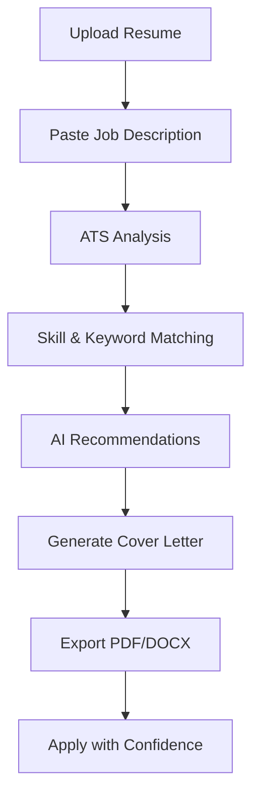

# 🚀 MAZ3R

> AI-Powered Resume Optimization & Cover Letter Generation Platform

MAZ3R helps job seekers tailor their resumes and generate professional cover letters that align with specific job descriptions. Instead of manually editing resumes for every application, users can upload their existing resume, paste a job description, and receive ATS insights, improvement recommendations, and a customized cover letter in minutes.

---

## ✨ Features

### 📄 Resume Upload & Parsing

- Upload resumes in **PDF** or **DOCX** format
- Automatic text extraction and processing
- Resume content analysis

### 🎯 ATS Optimization Engine

- ATS compatibility scoring
- Resume-to-job matching analysis
- Missing skill identification
- Keyword relevance analysis
- Resume improvement recommendations

### 🧠 AI-Powered Matching

- Semantic similarity scoring using sentence embeddings
- Skill extraction and classification
- Seniority detection
- Job requirement comparison
- Context-aware recommendations

### ✍️ Cover Letter Generation

- Generate professional cover letters tailored to specific job descriptions
- Powered by open-source AI models through Hugging Face
- Resume-aware content generation
- Easy editing and exporting

### 📊 ATS Dashboard

- ATS score visualization
- Matched skills overview
- Missing skills panel
- Recommendation engine
- Job application readiness insights

### 📥 Export & Reporting

- PDF ATS reports
- DOCX cover letter export
- Downloadable application materials

### 🔔 Job Alert Management

- Track target roles
- Monitor application opportunities
- Organize job search workflow

---

## 🏗️ Tech Stack

### Frontend

- HTML
- CSS
- Vanilla JavaScript

### Backend

- Flask
- SQLite
- Gunicorn

### AI & NLP

- Qwen 2.5 1.5B Instruct (Hugging Face Inference API)
- Sentence Transformers
- all-MiniLM-L6-v2 Embeddings

### Document Processing

- pdfplumber
- python-docx
- reportlab

### Deployment

- Docker
- Docker Compose
- Render
- GitHub Actions

---

## 🎯 Who Is MAZ3R For?

- Students applying for internships
- Fresh graduates entering the job market
- Professionals switching careers
- Job seekers applying to multiple positions
- Anyone looking to improve ATS performance and application quality

---

## 🚀 Workflow



---

## 📊 Core Capabilities

| Feature | Description |
|----------|-------------|
| ATS Score | Measures alignment between resume and job description |
| Semantic Matching | Uses embeddings to compare resume relevance |
| Skill Detection | Identifies matched and missing skills |
| Seniority Detection | Estimates experience level from resume content |
| Cover Letter AI | Generates customized cover letters |
| PDF Reports | Creates downloadable ATS analysis reports |
| DOCX Export | Exports cover letters and generated content |
| Job Alerts | Helps users track target opportunities |

---

## 🛠 Installation

### Clone Repository

```bash
git clone https://github.com/yourusername/MAZ3R.git
cd MAZ3R
```

### Create Environment File

```bash
cp .env.example .env
```

Add your Hugging Face API token:

```env
HF_API_TOKEN=your_token_here
```

### Install Dependencies

```bash
pip install -r requirements.txt
```

### Run Backend

```bash
python backend/app.py
```

### Run with Docker

```bash
docker compose up --build
```

---

## 🔌 API Endpoints

### Resume

```http
POST /api/resume/upload
POST /api/resume/analyze
```

### Cover Letter

```http
POST /api/cover-letter/generate
```

### Reports

```http
POST /api/reports/pdf
POST /api/reports/docx
```

### Health Check

```http
GET /api/health
```

---

## 🌟 Why MAZ3R?

Most applicants spend hours manually rewriting resumes and cover letters for each application.

MAZ3R streamlines the process by:

- Analyzing job requirements
- Identifying gaps
- Suggesting improvements
- Generating tailored content
- Providing ATS-focused insights

This allows users to focus more on applying and less on repetitive editing.

---

## 🔮 Future Roadmap

- Job board integrations
- Real-time job alerts
- Resume version management
- Multiple ATS scoring models
- LinkedIn profile optimization
- AI interview preparation
- Multi-language support

---

## 🤝 Contributing

Contributions, issues, and feature requests are welcome.

Feel free to fork the repository and submit pull requests.

---

## 📜 License

This project is released under the MIT License.

---

## 🚀 MAZ3R

**From Resume Draft → Interview Ready**
